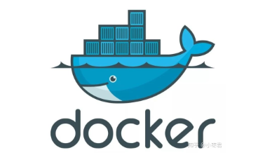

README about Docker.    

## What is docker    
Cloud is like a huge ship, dockers are building boxes on the ship.          
   

<strong>
"Build, ship and run"    
"Build once, run anywhere"    
</strong>    
Copy what I have done for current house as an image, put in a backpack; once go to a new place, paste this house design.      

3 core concepts:    
<b>Image</b>: provides needed program, repo, resources, configuration files as program needs, but also configuration parameters like environment variance.      
<b>Container</b>: the pasted house in the new place          
<b>Repository</b>: backpack           

Docker is an application that simplifies the process of managing application processes in containers. Containers let you run your applications in resource-isolated processes.    

Docker's start speed is quick, only need a few seconds; it can use resource very efficiently; also it only need little space (Virtual Machine needs GB, docker only needs MB or KB).

## Install   
https://www.digitalocean.com/community/tutorials/how-to-install-and-use-docker-on-ubuntu-18-04     
