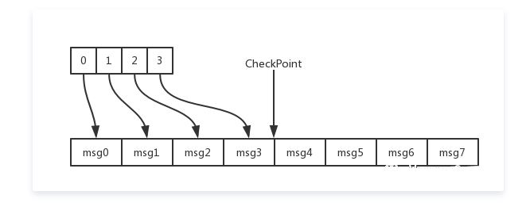

# Write-ahead logging   

In computer science, write-ahead logging is a family of techniques for providing atomicity and durability in database systems.    
The changes are first recorded in the log, which must be written to stable storage, before the changes are written to the database.    

在计算机领域，WAL（Write-ahead logging，预写式日志）是数据库系统提供原子性和持久化的一系列技术。    

在使用WAL的系统中，所有的修改都先被写入到日志中，然后再被应用到系统状态中。<b> 通常包含redo和undo两部分信息。</b>         
为什么需要使用WAL，然后包含redo和undo信息呢？举个例子，如果一个系统直接将变更应用到系统状态中，那么在机器掉电重启之后系统需要知道操作是成功了，还是只有部分成功或者是失败了（为了恢复状态）。如果使用了WAL，那么在重启之后系统可以通过比较日志和系统状态来决定是继续完成操作还是撤销操作。       

### redo log    
redo log称为重做日志，每当有操作时，在数据变更之前将操作写入redo log，这样当发生掉电之类的情况时系统可以在重启后继续操作。

### undo log    
undo log称为撤销日志，当一些变更执行到一半无法完成时，可以根据撤销日志恢复到变更之间的状态。   
MySQL中用redo log来在系统Crash重启之类的情况时修复数据（事务的持久性），而undo log来保证事务的原子性。    

## WAL在消息中间件中的应用
WAL可以说是消息中间件的基础，也是所有存储类系统的基础。    
在消息中间件中，WAL没有MySQL中那么复杂，我们只需要记redo log。消息直接存储在redo log中，只要写redo log完成了，那么消息就写入完成了：    
1. 消息写入redo log就表明持久化了    
2. 且不会出现原子性的问题，消息写入即成功，没写入即失败     

## 存储结构    
使用WAL存储数据，就需要去组织存储文件，比如MySQL的binlog文件。在消息中间件中也需要类似的形式去组织redo log，即消息的存储文件。   
我们采用固定大小的存储文件，这样在索引消息的时候，只要知道偏移量，就能找到对应的存储文件。比如下面是文件大小为1024的存储文件示例：    
0000000000 -> 0000001024 -> 0000002048 -> ....     
消息被不断的追加到最新的存储文件中。     
消息在文件中的存储格式大致如上：    
* 采用二进制的格式存储消息    
* 消息是不定长的    

所以这里会需要一个结构来索引消息。索引到一条完整的消息只需要两个元素：偏移量、大小。只要有这两个元素就可以从存储日志中读取一段完整的数据（一条完整的消息）。     
     

以上的结构是最简单的消息中间件存储的模型，虽然离真正应用到实践中还有一些距离，但是核心思想是一致的。   
考虑这几个问题：    
1. 消息具体的存储协议，即存储文件中消息需要包含哪些内容    
2. 如何优化索引结构，支持消息回溯、消息过滤等功能     

## Cash Recovery    
上文说了redo log用于在系统Crash之后做恢复（在中间件中也直接作为数据存储），那么redo log具体我们可以如何使用它进行系统状态的恢复呢？     
在消息写入的过程中，这里的状态只有一个，就是消息索引。只要消息索引构建了，那么消息就可以被消息；如果消息索引没构建，那么这条消息就是不可消费的（等价于消息没有写入）。    
那么这里的恢复就是在系统Crash之后如何构建索引。     
     

