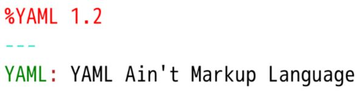

YAML (a recursive acronym for "YAML Ain't Markup Language") is a human-readable data-serialization language.     
It is commonly used for configuration files and in applications where data is being stored or transmitted. YAML targets many of the same communications applications as Extensible Markup Language (XML) but has a minimal syntax which intentionally differs from SGML.    

    
